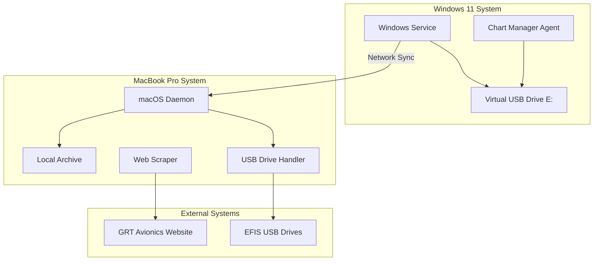

# Design Document

## Overview

The EFIS Data Manager consists of two main applications: a Windows service for virtual USB drive management and chart synchronization, and a macOS daemon for GRT software management and USB drive processing. The system uses a client-server architecture with the Windows machine acting as the chart data source and the MacBook as the central management hub.

## Architecture

### System Components



### Communication Flow

1. **Chart Data Flow**: Chart Manager → Virtual USB Drive → Windows Service → Network → macOS Daemon → Local Archive → USB Drive
2. **GRT Software Flow**: GRT Website → Web Scraper → macOS Daemon → Local Archive → USB Drive
3. **EFIS Data Flow**: USB Drive → macOS Daemon → Local Archive (Dropbox)

## Components and Interfaces

### Windows Service Component

**Purpose**: Manages virtual USB drive mounting and initiates chart data synchronization

**Key Classes**:
- `VirtualDriveManager`: Monitors and maintains E: drive mount status using ImDisk
- `NetworkSyncClient`: Handles file synchronization to MacBook
- `ServiceController`: Main service orchestration and scheduling
- `ImDiskWrapper`: Wrapper for ImDisk MountImg.exe operations

**Configuration**:
- Virtual Drive File: `C:\Users\fligh\OneDrive\Desktop\virtualEFISUSB.vhd`
- Mount Tool: `C:\Program Files\ImDisk\MountImg.exe`
- Log File: `C:\Scripts\MountEFIS.log`
- PowerShell Script: `C:\Scripts\MountEFIS.ps1`

**Interfaces**:
```
IVirtualDriveManager {
    checkMountStatus(): boolean
    mountDrive(): boolean
    unmountDrive(): boolean
    getDriveContents(): FileList
}

IImDiskWrapper {
    mountVHD(vhdPath: string, driveLetter: string): boolean
    unmountDrive(driveLetter: string): boolean
    isDriveMounted(driveLetter: string): boolean
}

INetworkSyncClient {
    checkConnectivity(target: string): boolean
    syncFiles(source: string, target: string): SyncResult
    getChangedFiles(since: timestamp): FileList
}
```

**Current Implementation**:
- Scheduled Task: "MountEFIS" runs as SYSTEM with highest privileges
- Triggers: At startup (1 minute delay) and every hour
- Command: `pwsh.exe -File "C:\Scripts\MountEFIS.ps1"`

**Enhanced Integration**:
The new Windows service will either:
1. Replace the scheduled task with a proper Windows service, or
2. Enhance the existing PowerShell script with additional synchronization logic
3. Monitor the scheduled task and add network sync capabilities as a separate service

### macOS Daemon Component

**Purpose**: Central management hub for GRT downloads, USB processing, and file orchestration

**Key Classes**:
- `GRTWebScraper`: Downloads and monitors GRT software updates
- `USBDriveProcessor`: Handles EFIS USB drive detection and processing
- `FileArchiveManager`: Manages local file archive and Dropbox integration
- `NetworkSyncServer`: Receives chart data from Windows system

**Interfaces**:
```
IGRTWebScraper {
    checkForUpdates(): UpdateInfo[]
    downloadFile(url: string, version: string): DownloadResult
    parseVersionInfo(html: string): VersionInfo
}

IUSBDriveProcessor {
    detectEFISDrive(drive: string): boolean
    processEFISFiles(drive: string): ProcessResult
    updateDriveContents(drive: string): UpdateResult
}
```

### Web Scraping Module

**Purpose**: Monitors GRT Avionics website for software updates

**Implementation Strategy**:
- Use HTTP requests with User-Agent headers to avoid blocking
- Parse HTML to extract version information and download links
- Implement retry logic with exponential backoff
- Cache version information to minimize web requests

**Version Detection Logic**:
1. **NAV Database**: Download daily and compare file hash/size
2. **HXr Software**: Parse version from URL path (e.g., `/HXr/8/01/`)
3. **Mini A/P Software**: Extract version from page description text
4. **AHRS Software**: Parse filename for version number
5. **Servo Software**: Parse filename and description for version

## Data Models

### Configuration Model
```typescript
interface SystemConfig {
    windows: {
        virtualDriveFile: string; // "C:\Users\fligh\OneDrive\Desktop\virtualEFISUSB.vhd"
        mountTool: string; // "C:\Program Files\ImDisk\MountImg.exe"
        driveLetter: string; // "E:"
        logFile: string; // "C:\Scripts\MountEFIS.log"
        syncInterval: number;
        macbookIP: string;
        retryAttempts: number;
    };
    macos: {
        archivePath: string; // "/Users/mwalker/Library/CloudStorage/Dropbox/Flying/EFIS-USB"
        demoPath: string; // "/Users/mwalker/Library/CloudStorage/Dropbox/Flying/EFIS-DEMO"
        logbookPath: string; // "/Users/mwalker/Library/CloudStorage/Dropbox/Flying/Logbooks"
        checkInterval: number;
        grtUrls: GRTUrlConfig;
    };
}

interface GRTUrlConfig {
    navDatabase: string;
    hxrSoftware: string;
    miniAPSoftware: string;
    ahrsSoftware: string;
    servoSoftware: string;
}
```

### File Tracking Model
```typescript
interface FileMetadata {
    path: string;
    size: number;
    hash: string;
    lastModified: Date;
    version?: string;
}

interface SyncResult {
    filesTransferred: number;
    bytesTransferred: number;
    errors: string[];
    duration: number;
}
```

### USB Drive Model
```typescript
interface EFISDrive {
    mountPath: string;
    identifier: string;
    capacity: number;
    demoFiles: string[];
    snapFiles: string[];
    logbookFiles: string[];
}
```

## Error Handling

### Network Connectivity Issues
- Implement connection pooling with timeout handling
- Use exponential backoff for retry attempts
- Graceful degradation when MacBook is offline for extended periods
- Queue operations for execution when connectivity returns

### File System Errors
- Implement file locking detection and retry logic
- Use atomic file operations where possible
- Verify file integrity after transfers using checksums
- Maintain transaction logs for rollback capability

### Web Scraping Resilience
- Handle HTTP errors (404, 500, timeout) gracefully
- Implement rate limiting to avoid being blocked
- Parse HTML defensively with fallback strategies
- Cache successful responses to reduce web requests

### USB Drive Handling
- Detect drive removal during operations
- Implement safe eject procedures
- Handle read-only drives and permission issues
- Validate drive capacity before large transfers

## Testing Strategy

### Unit Testing
- Mock external dependencies (file system, network, USB)
- Test error conditions and edge cases
- Validate configuration parsing and validation
- Test version comparison and parsing logic

### Integration Testing
- Test Windows-to-macOS file synchronization
- Validate USB drive detection and processing
- Test GRT website scraping with cached responses
- Verify file integrity across all transfer operations

### System Testing
- End-to-end workflow testing with real USB drives
- Network failure simulation and recovery testing
- Extended offline operation testing
- Performance testing with large chart data sets

### Manual Testing Procedures
- USB drive preparation and validation
- Software update notification verification
- File archive integrity checking
- Cross-platform compatibility validation

## Security Considerations

### Network Communication
- Use secure file transfer protocols (SFTP/SCP)
- Implement authentication between Windows and macOS systems
- Validate file paths to prevent directory traversal attacks
- Encrypt sensitive configuration data

### File System Access
- Run services with minimal required privileges
- Validate USB drive contents before processing
- Sanitize file names and paths
- Implement access logging for audit trails

### Web Scraping Security
- Validate downloaded files before execution
- Use HTTPS for all GRT website communications
- Implement content validation for downloaded software
- Maintain whitelist of allowed download domains

## Performance Optimization

### File Transfer Optimization
- Use rsync-style algorithms for incremental transfers
- Implement parallel file transfers where appropriate
- Compress data during network transfers
- Use file system change notifications to minimize scanning

### Resource Management
- Implement connection pooling for network operations
- Use memory-mapped files for large file operations
- Implement disk space monitoring and cleanup
- Optimize USB drive access patterns

### Caching Strategy
- Cache GRT website responses to minimize requests
- Maintain local metadata cache for file comparisons
- Implement intelligent cache invalidation
- Use persistent storage for configuration and state