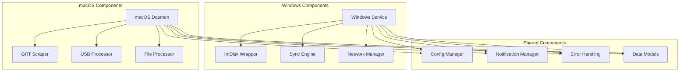

# EFIS Data Manager Developer Guide

This document provides comprehensive information for developers who want to contribute to or extend the EFIS Data Manager system.

## Table of Contents

- [Development Environment Setup](#development-environment-setup)
- [Project Architecture](#project-architecture)
- [Development Workflow](#development-workflow)
- [Code Standards](#code-standards)
- [Testing Guidelines](#testing-guidelines)
- [Contributing Guidelines](#contributing-guidelines)
- [Debugging and Profiling](#debugging-and-profiling)
- [Release Process](#release-process)
- [Extension Points](#extension-points)

## Development Environment Setup

### Prerequisites

- **Python 3.8+** with pip and venv
- **Git** for version control
- **SSH client** for cross-platform communication
- **Code editor** with Python support (VS Code, PyCharm, etc.)

### Platform-Specific Requirements

#### Windows Development
- **ImDisk Toolkit** for virtual drive operations
- **PowerShell 5.0+** for script execution
- **Windows SDK** (optional, for service development)

#### macOS Development
- **Xcode Command Line Tools** for system integration
- **Homebrew** (recommended for package management)

### Initial Setup

1. **Clone the repository:**
   ```bash
   git clone https://github.com/your-org/efis-data-manager.git
   cd efis-data-manager
   ```

2. **Set up development environment:**
   
   **macOS:**
   ```bash
   ./setup_dev_macos.sh
   ```
   
   **Windows:**
   ```cmd
   setup_dev_windows.bat
   ```

3. **Verify installation:**
   ```bash
   # macOS
   source macos/venv/bin/activate
   python -c "import efis_macos; print('macOS setup successful')"
   
   # Windows
   windows\venv\Scripts\activate.bat
   python -c "import efis_windows; print('Windows setup successful')"
   ```

### IDE Configuration

#### VS Code Setup

Create `.vscode/settings.json`:
```json
{
    "python.defaultInterpreterPath": "./macos/venv/bin/python",
    "python.linting.enabled": true,
    "python.linting.pylintEnabled": true,
    "python.linting.flake8Enabled": true,
    "python.formatting.provider": "black",
    "python.testing.pytestEnabled": true,
    "python.testing.pytestArgs": ["tests/"],
    "files.exclude": {
        "**/__pycache__": true,
        "**/*.pyc": true,
        "**/venv": true
    }
}
```

Create `.vscode/launch.json`:
```json
{
    "version": "0.2.0",
    "configurations": [
        {
            "name": "macOS Daemon",
            "type": "python",
            "request": "launch",
            "program": "macos/src/efis_macos/daemon.py",
            "args": ["--debug"],
            "cwd": "${workspaceFolder}/macos",
            "env": {
                "PYTHONPATH": "${workspaceFolder}/macos/src:${workspaceFolder}/shared"
            }
        },
        {
            "name": "Windows Service",
            "type": "python",
            "request": "launch",
            "program": "windows/src/efis_windows/service.py",
            "args": ["--debug"],
            "cwd": "${workspaceFolder}/windows",
            "env": {
                "PYTHONPATH": "${workspaceFolder}/windows/src:${workspaceFolder}/shared"
            }
        }
    ]
}
```

## Project Architecture

### Directory Structure

```
efis-data-manager/
├── shared/                     # Shared utilities and models
│   ├── config/                # Configuration management
│   ├── models/                # Data models and types
│   ├── notifications/         # Notification system
│   ├── error_handling/        # Error handling utilities
│   └── utils/                 # General utilities
├── windows/                   # Windows-specific components
│   ├── src/efis_windows/     # Windows service implementation
│   ├── config/               # Windows configuration
│   └── logs/                 # Windows log files
├── macos/                    # macOS-specific components
│   ├── src/efis_macos/      # macOS daemon implementation
│   ├── config/              # macOS configuration
│   └── logs/                # macOS log files
├── tests/                    # Test files
│   ├── shared/              # Shared component tests
│   ├── windows/             # Windows component tests
│   ├── macos/               # macOS component tests
│   └── integration/         # Integration tests
├── docs/                     # Documentation
└── config/                   # Global configuration templates
```

### Component Dependencies



### Key Design Patterns

#### 1. Configuration Management Pattern
```python
# Centralized configuration with validation
class ConfigManager:
    def __init__(self):
        self._config = {}
        self._validators = {}
    
    def get(self, key: str, default=None):
        return self._get_nested_value(key, default)
    
    def set(self, key: str, value):
        self._set_nested_value(key, value)
        self._validate_key(key, value)
```

#### 2. Error Handling Pattern
```python
# Decorator-based error handling with retry logic
def handle_file_operation(retries=3, backoff=1.0):
    def decorator(func):
        @wraps(func)
        def wrapper(*args, **kwargs):
            for attempt in range(retries):
                try:
                    return func(*args, **kwargs)
                except FileSystemError as e:
                    if attempt == retries - 1:
                        raise
                    time.sleep(backoff * (2 ** attempt))
        return wrapper
    return decorator
```

#### 3. Observer Pattern for USB Detection
```python
# USB drive monitoring with callbacks
class USBMonitor:
    def __init__(self):
        self._observers = []
    
    def add_observer(self, callback):
        self._observers.append(callback)
    
    def notify_drive_inserted(self, drive_path):
        for observer in self._observers:
            observer.on_drive_inserted(drive_path)
```

## Development Workflow

### Branch Strategy

- **main**: Production-ready code
- **develop**: Integration branch for features
- **feature/**: Individual feature branches
- **hotfix/**: Critical bug fixes
- **release/**: Release preparation

### Feature Development Process

1. **Create feature branch:**
   ```bash
   git checkout develop
   git pull origin develop
   git checkout -b feature/new-feature-name
   ```

2. **Implement feature:**
   - Write code following standards
   - Add comprehensive tests
   - Update documentation
   - Test on both platforms

3. **Commit changes:**
   ```bash
   git add .
   git commit -m "feat: add new feature description"
   ```

4. **Create pull request:**
   - Target `develop` branch
   - Include description and testing notes
   - Request review from maintainers

### Local Development Commands

```bash
# Run tests
python -m pytest tests/

# Run specific test suite
python -m pytest tests/macos/

# Run with coverage
python -m pytest --cov=src tests/

# Format code
black src/ tests/

# Lint code
flake8 src/ tests/
pylint src/

# Type checking
mypy src/
```

### Development Configuration

Create `config/efis_config.development.yaml`:
```yaml
environment: "development"

logging:
  logLevel: "DEBUG"
  logToConsole: true
  coloredOutput: true

windows:
  syncInterval: 300  # More frequent for testing
  retryAttempts: 1   # Faster failure for debugging

macos:
  checkInterval: 600  # More frequent for testing
  
notifications:
  enableDesktop: true
  enableEmail: false  # Disable email in development
```

## Code Standards

### Python Style Guide

Follow PEP 8 with these specific guidelines:

#### 1. Import Organization
```python
# Standard library imports
import os
import sys
from datetime import datetime
from typing import Dict, List, Optional

# Third-party imports
import yaml
import requests

# Local imports
from shared.config.config_manager import ConfigManager
from shared.models.data_models import FileMetadata
```

#### 2. Type Hints
```python
# Always use type hints for function parameters and return values
def process_files(file_paths: List[str], 
                 target_dir: str) -> ProcessResult:
    """Process files and return results."""
    pass

# Use Optional for nullable values
def get_config_value(key: str) -> Optional[str]:
    """Get configuration value or None if not found."""
    pass
```

#### 3. Docstring Format
```python
def sync_files(source: str, target: str, options: Dict[str, Any]) -> SyncResult:
    """
    Synchronize files from source to target location.
    
    Args:
        source: Source directory path
        target: Target directory path  
        options: Synchronization options including:
            - compression: Enable compression (default: True)
            - verify: Verify file integrity (default: True)
            - exclude: List of patterns to exclude
    
    Returns:
        SyncResult object containing operation results
        
    Raises:
        NetworkError: If target is unreachable
        FileSystemError: If file operations fail
        
    Example:
        >>> result = sync_files('/source', '/target', {'compression': True})
        >>> print(f"Transferred {result.files_transferred} files")
    """
```

#### 4. Error Handling
```python
# Use specific exception types
try:
    result = risky_operation()
except NetworkError as e:
    logger.error(f"Network operation failed: {e}")
    raise
except FileSystemError as e:
    logger.warning(f"File operation failed, retrying: {e}")
    # Retry logic here
except Exception as e:
    logger.critical(f"Unexpected error: {e}")
    raise
```

#### 5. Logging
```python
# Use structured logging with context
logger = logging.getLogger(__name__)

def process_usb_drive(drive_path: str) -> ProcessResult:
    logger.info("Starting USB drive processing", extra={
        'drive_path': drive_path,
        'operation': 'usb_processing'
    })
    
    try:
        # Processing logic
        logger.debug("Processing demo files", extra={
            'file_count': len(demo_files),
            'drive_path': drive_path
        })
        
    except Exception as e:
        logger.error("USB processing failed", extra={
            'drive_path': drive_path,
            'error': str(e),
            'operation': 'usb_processing'
        })
        raise
```

### Configuration Standards

#### 1. Configuration Keys
- Use snake_case for configuration keys
- Group related settings under common prefixes
- Provide sensible defaults
- Include validation rules

```yaml
# Good configuration structure
windows:
  virtual_drive:
    file_path: "C:/path/to/file.vhd"
    mount_tool: "C:/Program Files/ImDisk/MountImg.exe"
    drive_letter: "E:"
    check_interval: 300
  
  sync:
    target_host: "192.168.1.100"
    interval: 1800
    timeout: 300
    retry_attempts: 3
```

#### 2. Environment Variables
```python
# Use environment variables for sensitive data
import os

def get_email_credentials():
    return {
        'username': os.getenv('EFIS_EMAIL_USERNAME'),
        'password': os.getenv('EFIS_EMAIL_PASSWORD')
    }
```

## Testing Guidelines

### Test Structure

```
tests/
├── conftest.py              # Shared test fixtures
├── shared/                  # Shared component tests
│   ├── test_config_manager.py
│   └── test_data_models.py
├── windows/                 # Windows component tests
│   ├── test_imdisk_wrapper.py
│   └── test_sync_engine.py
├── macos/                   # macOS component tests
│   ├── test_grt_scraper.py
│   └── test_usb_processor.py
└── integration/             # Integration tests
    ├── test_end_to_end.py
    └── test_cross_platform.py
```

### Test Categories

#### 1. Unit Tests
```python
import pytest
from unittest.mock import Mock, patch
from shared.config.config_manager import ConfigManager

class TestConfigManager:
    def test_get_existing_key(self):
        """Test getting an existing configuration key."""
        config = ConfigManager()
        config._config = {'windows': {'driveLetter': 'E:'}}
        
        result = config.get('windows.driveLetter')
        assert result == 'E:'
    
    def test_get_nonexistent_key_with_default(self):
        """Test getting a non-existent key with default value."""
        config = ConfigManager()
        config._config = {}
        
        result = config.get('nonexistent.key', 'default')
        assert result == 'default'
    
    @patch('builtins.open')
    @patch('yaml.safe_load')
    def test_load_config_file_not_found(self, mock_yaml, mock_open):
        """Test loading configuration when file doesn't exist."""
        mock_open.side_effect = FileNotFoundError()
        
        config = ConfigManager()
        with pytest.raises(FileNotFoundError):
            config.load_config('nonexistent.yaml')
```

#### 2. Integration Tests
```python
import pytest
import tempfile
import os
from pathlib import Path

class TestUSBDriveProcessing:
    @pytest.fixture
    def mock_usb_drive(self):
        """Create a mock USB drive for testing."""
        with tempfile.TemporaryDirectory() as temp_dir:
            drive_path = Path(temp_dir)
            
            # Create EFIS identification marker
            (drive_path / 'EFIS_DRIVE.txt').write_text('EFIS Data Drive')
            
            # Create sample demo files
            (drive_path / 'DEMO-20231201-143022.LOG').write_text('demo data')
            (drive_path / 'DEMO-20231201-143023+1.LOG').write_text('demo data')
            
            # Create sample snap files
            (drive_path / 'snap001.png').write_bytes(b'fake png data')
            
            yield str(drive_path)
    
    def test_efis_drive_detection(self, mock_usb_drive):
        """Test EFIS drive detection with proper markers."""
        from macos.src.efis_macos.usb_drive_processor import USBDriveProcessor
        
        processor = USBDriveProcessor({})
        result = processor.detect_efis_drive(mock_usb_drive)
        
        assert result is True
    
    def test_demo_file_processing(self, mock_usb_drive):
        """Test processing of demo files from USB drive."""
        from macos.src.efis_macos.usb_drive_processor import USBDriveProcessor
        
        config = {
            'demoPath': '/tmp/test-demo'
        }
        processor = USBDriveProcessor(config)
        
        result = processor.process_efis_files(mock_usb_drive)
        
        assert result.status == 'SUCCESS'
        assert result.files_processed >= 2  # Two demo files
```

#### 3. Mock Usage Guidelines
```python
# Mock external dependencies, not internal logic
@patch('requests.get')
def test_grt_website_scraping(self, mock_get):
    """Test GRT website scraping with mocked HTTP response."""
    # Mock the HTTP response
    mock_response = Mock()
    mock_response.status_code = 200
    mock_response.text = '<html>Version 8.01</html>'
    mock_get.return_value = mock_response
    
    from macos.src.efis_macos.grt_scraper import GRTScraper
    scraper = GRTScraper({})
    
    version = scraper.parse_version_info(mock_response.text, 'hxr')
    assert version == '8.01'

# Don't mock internal methods - test them directly
def test_file_validation():
    """Test file validation logic directly."""
    from shared.utils.file_utils import validate_demo_filename
    
    assert validate_demo_filename('DEMO-20231201-143022.LOG') is True
    assert validate_demo_filename('invalid-filename.txt') is False
```

### Test Fixtures

```python
# conftest.py
import pytest
import tempfile
from pathlib import Path
from shared.config.config_manager import ConfigManager

@pytest.fixture
def temp_config_file():
    """Create a temporary configuration file for testing."""
    config_data = {
        'windows': {
            'virtualDriveFile': 'C:/test.vhd',
            'driveLetter': 'E:',
            'macbookIP': '192.168.1.100'
        },
        'macos': {
            'archivePath': '/tmp/test-archive',
            'demoPath': '/tmp/test-demo'
        },
        'logging': {
            'logLevel': 'DEBUG'
        }
    }
    
    with tempfile.NamedTemporaryFile(mode='w', suffix='.yaml', delete=False) as f:
        yaml.dump(config_data, f)
        yield f.name
    
    os.unlink(f.name)

@pytest.fixture
def config_manager(temp_config_file):
    """Create a ConfigManager instance with test configuration."""
    config = ConfigManager()
    config.load_config(temp_config_file)
    return config
```

### Running Tests

```bash
# Run all tests
python -m pytest

# Run specific test file
python -m pytest tests/shared/test_config_manager.py

# Run with coverage
python -m pytest --cov=src --cov-report=html tests/

# Run integration tests only
python -m pytest tests/integration/

# Run tests with verbose output
python -m pytest -v

# Run tests matching pattern
python -m pytest -k "test_config"
```

## Contributing Guidelines

### Pull Request Process

1. **Fork the repository** and create a feature branch
2. **Write comprehensive tests** for new functionality
3. **Update documentation** for any API changes
4. **Ensure all tests pass** on both platforms
5. **Follow code style guidelines** and pass linting
6. **Write clear commit messages** following conventional commits

### Commit Message Format

```
type(scope): description

[optional body]

[optional footer]
```

Types:
- `feat`: New feature
- `fix`: Bug fix
- `docs`: Documentation changes
- `style`: Code style changes (formatting, etc.)
- `refactor`: Code refactoring
- `test`: Adding or updating tests
- `chore`: Maintenance tasks

Examples:
```
feat(grt-scraper): add support for new GRT software versions

Add parsing logic for GRT software version 9.x format.
Includes backward compatibility with existing versions.

Closes #123

fix(usb-processor): handle USB drives with no identification markers

Previously the system would crash when processing USB drives
without EFIS identification markers. Now it gracefully skips
non-EFIS drives.

Fixes #456
```

### Code Review Guidelines

#### For Authors:
- Keep pull requests focused and small
- Include tests for all new functionality
- Update documentation for API changes
- Test on both Windows and macOS if applicable
- Respond promptly to review feedback

#### For Reviewers:
- Check for code style and standards compliance
- Verify test coverage is adequate
- Test functionality manually if needed
- Provide constructive feedback
- Approve only when confident in the changes

### Documentation Requirements

- **API changes**: Update API reference documentation
- **Configuration changes**: Update configuration guide
- **New features**: Add to user documentation
- **Bug fixes**: Update troubleshooting guide if applicable

## Debugging and Profiling

### Debug Mode

Enable debug mode for detailed logging:

```bash
# macOS
./macos/efis --debug

# Windows
windows\efis.bat --debug
```

### Logging Configuration for Development

```yaml
# config/efis_config.development.yaml
logging:
  logLevel: "DEBUG"
  logToConsole: true
  coloredOutput: true
  components:
    grt_scraper: "DEBUG"
    usb_processor: "DEBUG"
    sync_engine: "DEBUG"
    config_manager: "DEBUG"
```

### Performance Profiling

```python
# Add profiling to performance-critical functions
import cProfile
import pstats

def profile_function(func):
    """Decorator to profile function performance."""
    def wrapper(*args, **kwargs):
        profiler = cProfile.Profile()
        profiler.enable()
        
        result = func(*args, **kwargs)
        
        profiler.disable()
        stats = pstats.Stats(profiler)
        stats.sort_stats('cumulative')
        stats.print_stats(10)  # Top 10 functions
        
        return result
    return wrapper

@profile_function
def sync_large_dataset():
    # Performance-critical code here
    pass
```

### Memory Profiling

```python
# Monitor memory usage
import psutil
import tracemalloc

def monitor_memory():
    """Monitor memory usage during operation."""
    tracemalloc.start()
    
    # Your code here
    
    current, peak = tracemalloc.get_traced_memory()
    process = psutil.Process()
    memory_info = process.memory_info()
    
    print(f"Current memory: {current / 1024 / 1024:.1f}MB")
    print(f"Peak memory: {peak / 1024 / 1024:.1f}MB")
    print(f"RSS: {memory_info.rss / 1024 / 1024:.1f}MB")
    
    tracemalloc.stop()
```

### Remote Debugging

For debugging cross-platform issues:

```python
# Enable remote debugging with debugpy
import debugpy

# Start debug server
debugpy.listen(5678)
print("Waiting for debugger to attach...")
debugpy.wait_for_client()
```

## Release Process

### Version Management

Use semantic versioning (MAJOR.MINOR.PATCH):
- **MAJOR**: Breaking changes
- **MINOR**: New features (backward compatible)
- **PATCH**: Bug fixes (backward compatible)

### Release Checklist

1. **Update version numbers** in all relevant files
2. **Update CHANGELOG.md** with release notes
3. **Run full test suite** on both platforms
4. **Update documentation** if needed
5. **Create release branch** from develop
6. **Tag release** with version number
7. **Merge to main** and deploy
8. **Create GitHub release** with release notes

### Automated Testing

```yaml
# .github/workflows/test.yml
name: Test Suite

on: [push, pull_request]

jobs:
  test-windows:
    runs-on: windows-latest
    steps:
      - uses: actions/checkout@v2
      - uses: actions/setup-python@v2
        with:
          python-version: '3.8'
      - run: setup_dev_windows.bat
      - run: python -m pytest tests/windows/ tests/shared/
  
  test-macos:
    runs-on: macos-latest
    steps:
      - uses: actions/checkout@v2
      - uses: actions/setup-python@v2
        with:
          python-version: '3.8'
      - run: ./setup_dev_macos.sh
      - run: python -m pytest tests/macos/ tests/shared/
```

## Extension Points

### Adding New File Processors

```python
# Create new processor by extending base class
from shared.processors.base_processor import BaseFileProcessor

class CustomFileProcessor(BaseFileProcessor):
    """Process custom file types from EFIS drives."""
    
    def can_process(self, file_path: str) -> bool:
        """Check if this processor can handle the file."""
        return file_path.endswith('.custom')
    
    def process_file(self, file_path: str, target_dir: str) -> ProcessResult:
        """Process the custom file."""
        # Implementation here
        pass

# Register processor
from macos.src.efis_macos.usb_drive_processor import USBDriveProcessor
USBDriveProcessor.register_processor(CustomFileProcessor())
```

### Adding New Notification Channels

```python
# Create new notification channel
from shared.notifications.base_notifier import BaseNotifier

class SlackNotifier(BaseNotifier):
    """Send notifications to Slack."""
    
    def __init__(self, webhook_url: str):
        self.webhook_url = webhook_url
    
    def send_notification(self, title: str, message: str, 
                         notification_type: NotificationType) -> bool:
        """Send notification to Slack."""
        # Implementation here
        pass

# Register notifier
from shared.notifications.notification_manager import NotificationManager
manager = NotificationManager(config)
manager.add_notifier(SlackNotifier(webhook_url))
```

### Adding New Configuration Validators

```python
# Create custom validator
from shared.config.validation import ConfigValidator

def validate_ip_address(value: str) -> bool:
    """Validate IP address format."""
    import ipaddress
    try:
        ipaddress.ip_address(value)
        return True
    except ValueError:
        return False

# Register validator
validator = ConfigValidator()
validator.add_rule('windows.macbookIP', validate_ip_address)
```

This developer guide provides comprehensive information for contributing to the EFIS Data Manager project. For additional questions, please refer to the project documentation or open an issue on GitHub.